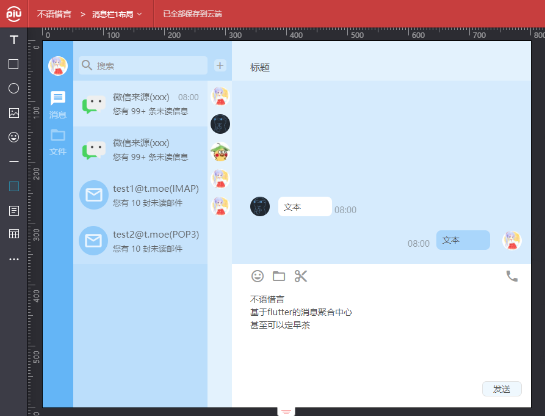

# 不语惜言

基于 [Flutter](https://flutter.dev/) 的消息聚合与即时通讯系统。

## bu_yu_xi_yan

An application to aggregate your messages from everywhere.

Base on [Flutter](https://flutter.dev/) .

## Start

1.Install [Flutter SDK](https://flutter.dev/docs/get-started/install) .

2.Install [IDEA](https://www.jetbrains.com/idea/download/index.html) (non-required).

3.Clone.

```
git clone https://github.com/Ricardo2001ZG/bu_yu_xi_yan.git
```

4.If you want to build your web application,
you need to use experimental canvas,
because of the bug [issues/55627](https://github.com/flutter/flutter/issues/55627)
in TextField.

```
flutter build web --dart-define=FLUTTER_WEB_USE_EXPERIMENTAL_CANVAS_TEXT=true
```

5.Enjoy yourself.

## 开始

1、安装Flutter SDK

首先，请参照 [此处](https://flutter.dev/docs/get-started/install) 安装Flutter SDK。

2、准备IDEA环境(非必需)

由于项目本身使用IDEA进行开发，为便于管理，建议使用IDEA。点击 [此处](https://www.jetbrains.com/idea/download/index.html) 下载安装。

注：IDEA本身属于收费软件，学生可使用其教育许可免费使用。软件与 [申请页面](https://www.jetbrains.com/community/education/#students) 均为英文。建议初学者使用。

3、下载代码。

```
git clone https://github.com/Ricardo2001ZG/bu_yu_xi_yan.git
```

4、解压后导入项目即可。经作者测试导入后可直接正常开发，如有问题请自行开启Flutter的Web支持，项目目前未适配 Web(Chrome Win10) 以外的任何平台。Windows 10、Linux、MacOS、Fuchsia长期计划支持。

5、如果需要build构建web程序，建议开启 experimental canvas ，原因为TextField在
多行显示时会出现无法选中部分段落的bug [issues/55627](https://github.com/flutter/flutter/issues/55627) 。

同时提醒，即使开启了实验canvas渲染，在多行段落选择时光标仍会出现错位现象。

开启方式为

```
flutter build web --dart-define=FLUTTER_WEB_USE_EXPERIMENTAL_CANVAS_TEXT=true
```

## 项目预期(Expectation)

